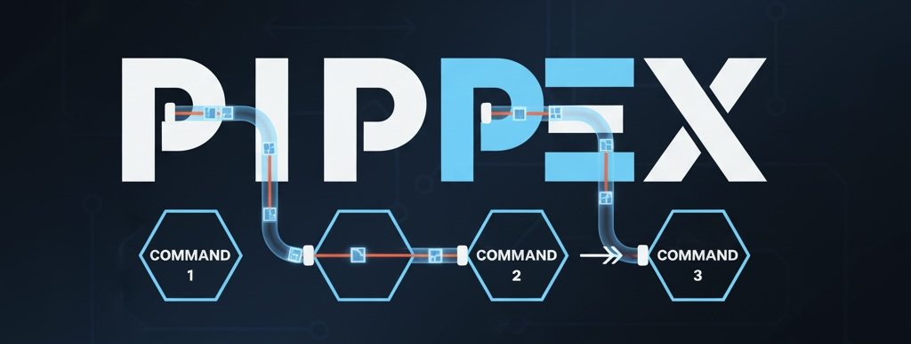

<div align="center">



A recreation of the shell pipe mechanism using processes and file descriptors. Part of the 42 school curriculum.

</div>

---

## 📋 Table of Contents
- [What is Pipex?](#what-is-pipex)
- [Installation](#installation)
- [Usage](#usage)
- [How It Works](#how-it-works)

---

## What is Pipex?

Reproduce the behavior of the shell pipe operator (`|`) using **processes**, **pipes**, and **file descriptors**. Execute two commands in a pipeline.

**Features:**
- ✅ Inter-process communication with pipes
- ✅ File descriptor redirection
- ✅ Command path resolution via `PATH`
- ✅ Full error handling

---

## Installation

```bash
# Clone and compile
git clone <repo-url>
cd pipex
make

# The executable 'pipex' is created
```

---

## Usage

```bash
# Basic syntax
./pipex infile "cmd1" "cmd2" outfile

# Equivalent to shell:
< infile cmd1 | cmd2 > outfile
```

**Examples:**

```bash
# Count lines containing "hello"
./pipex infile "grep hello" "wc -l" outfile

# List and filter
./pipex input.txt "ls -l" "grep pipex" output.txt

# Text processing
./pipex file.txt "cat" "tr 'a-z' 'A-Z'" result.txt

# Multiple pipes in shell equivalent
./pipex data.txt "grep pattern" "sort" sorted.txt
```

**Output:** Creates `outfile` with the result of `cmd2` processing `cmd1`'s output

---

## How It Works

### Step 1: Process Creation

Pipex creates **two child processes** using `fork()`:

```
Parent Process
     │
     ├──> Child 1 (executes cmd1)
     │
     └──> Child 2 (executes cmd2)
```

---

### Step 2: Pipe Setup

A **pipe** is created to connect the two processes:

```
┌─────────────────────────────────────────────────┐
│                                                 │
│  Child 1              PIPE              Child 2 │
│  ┌──────┐         ┌────────┐         ┌──────┐  │
│  │ cmd1 │────────>│ [1][0] │────────>│ cmd2 │  │
│  └──────┘  write  └────────┘  read   └──────┘  │
│                                                 │
└─────────────────────────────────────────────────┘
```

**Pipe:** `pipefd[0]` = read end, `pipefd[1]` = write end

---

### Step 3: File Descriptor Redirection

Each child process redirects its **input/output** using `dup2()`:

**Child 1:**
```c
dup2(infile, STDIN);      // Read from infile
dup2(pipefd[1], STDOUT);  // Write to pipe
execve(cmd1);             // Execute command
```

**Child 2:**
```c
dup2(pipefd[0], STDIN);   // Read from pipe
dup2(outfile, STDOUT);    // Write to outfile
execve(cmd2);             // Execute command
```

---

### Visual Example: `./pipex in.txt "grep hello" "wc -l" out.txt`

```
════════════════════════════════════════════════════════
INITIAL STATE
════════════════════════════════════════════════════════

in.txt contains:
  hello world
  goodbye world
  hello again

════════════════════════════════════════════════════════
EXECUTION FLOW
════════════════════════════════════════════════════════

1. Parent creates pipe:
   pipefd[0] ←─── pipefd[1]
   (read)         (write)

2. Fork Child 1:

   ┌─────────────────────────┐
   │ Child 1: grep hello     │
   │                         │
   │ Input:  in.txt          │
   │ Output: pipe[1]         │
   │                         │
   │ Writes to pipe:         │
   │   hello world           │
   │   hello again           │
   └─────────────────────────┘
                │
                ▼
           ┌─────────┐
           │  PIPE   │
           └─────────┘
                │
                ▼
   ┌─────────────────────────┐
   │ Child 2: wc -l          │
   │                         │
   │ Input:  pipe[0]         │
   │ Output: out.txt         │
   │                         │
   │ Reads from pipe and     │
   │ writes to out.txt:      │
   │   2                     │
   └─────────────────────────┘

3. Parent waits for both children

4. out.txt contains: 2

✓ PIPELINE COMPLETE!
```

---

### Command Path Resolution

Pipex finds commands using the `PATH` environment variable:

```c
1. Extract PATH: /usr/bin:/bin:/usr/local/bin
2. Split by ':' → ["/usr/bin", "/bin", "/usr/local/bin"]
3. For each path:
   - Join: "/usr/bin" + "/" + "grep" = "/usr/bin/grep"
   - Check: access("/usr/bin/grep", X_OK)
   - If executable: return path
4. If not found: "command not found" (exit 127)
```

---

## Project Structure

```
pipex/
├── includes/pipex.h          # Header file with structures
├── pipex.c                   # Main logic and process handling
├── utils.c                   # Path resolution and helpers
├── libft/
│   ├── ft_split.c           # String splitting
│   ├── ft_strjoin.c         # String concatenation
│   └── ft_strncmp.c         # String comparison
└── Makefile                 # Build configuration
```

---

## Error Handling

✅ **Valid:**
- `./pipex in.txt "cat" "wc -l" out.txt`
- `./pipex file "grep pattern" "sort" result`

❌ **Invalid (prints error):**
- Wrong arguments: `./pipex file cmd1`
- Command not found: `./pipex in "invalid_cmd" "wc" out`
- File doesn't exist: Uses `/dev/null` for input, creates output

**Exit Codes:**
- `0`: Success
- `1`: General errors (files, pipes)
- `127`: Command not found

---

## System Calls Used

| Call | Purpose |
|------|---------|
| `fork()` | Create child processes |
| `pipe()` | Create communication channel |
| `dup2()` | Redirect file descriptors |
| `execve()` | Execute commands |
| `waitpid()` | Wait for children |
| `access()` | Check executable permissions |

---

## Author

**akoaik** - 42 School

---

## Clean Up

```bash
make clean   # Remove .o files
make fclean  # Remove .o and executable
make re      # Rebuild
```
